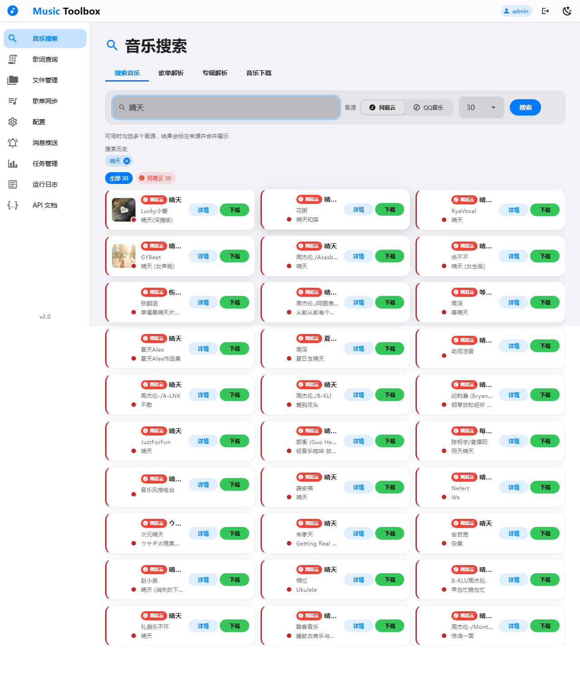
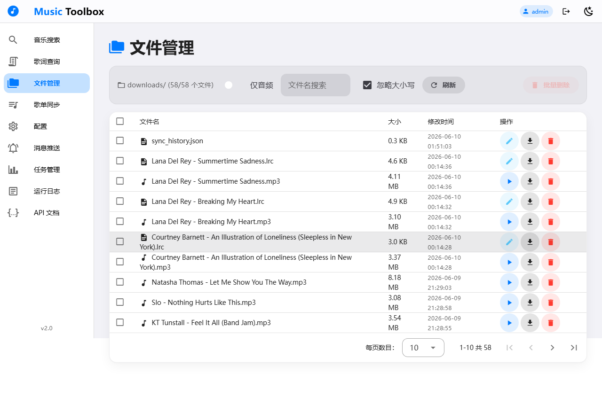
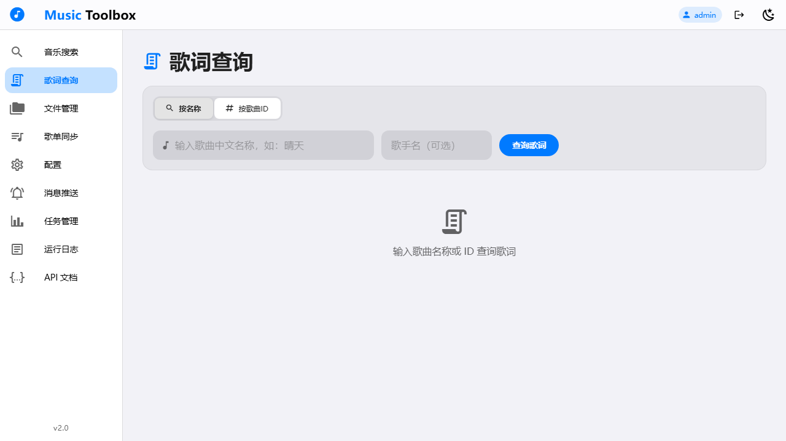
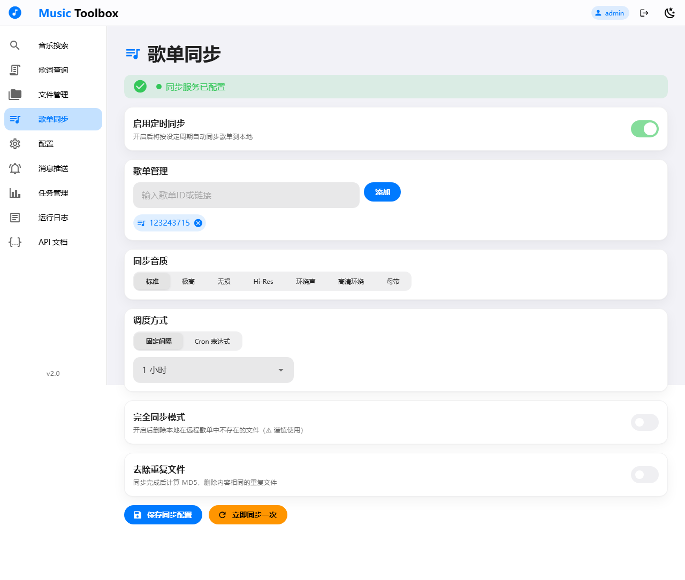
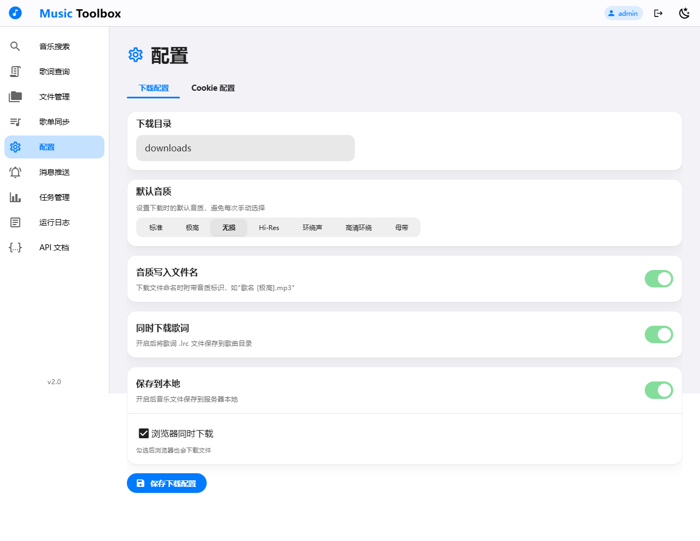
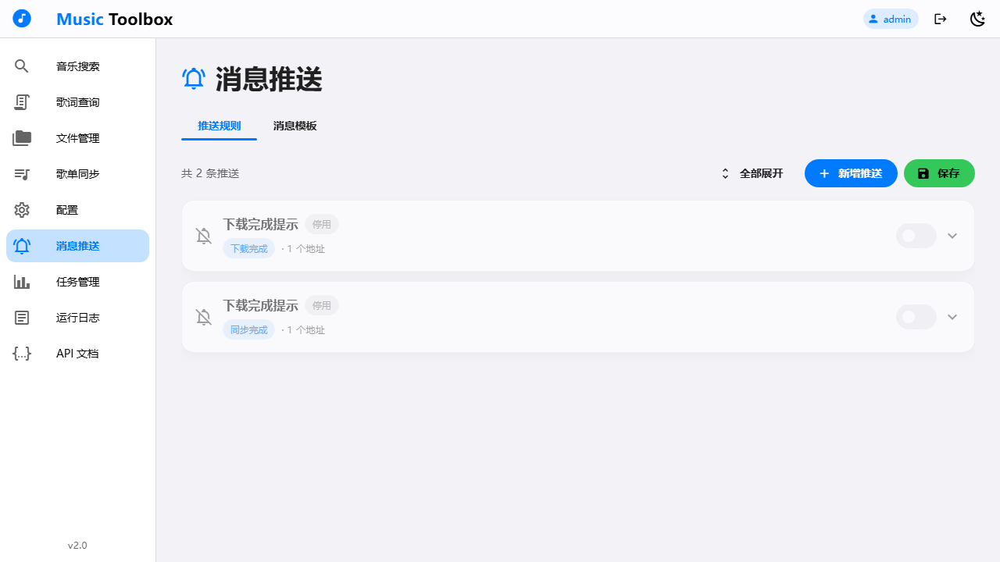
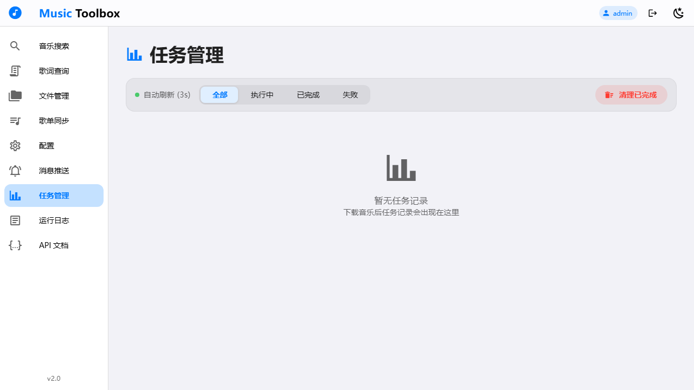
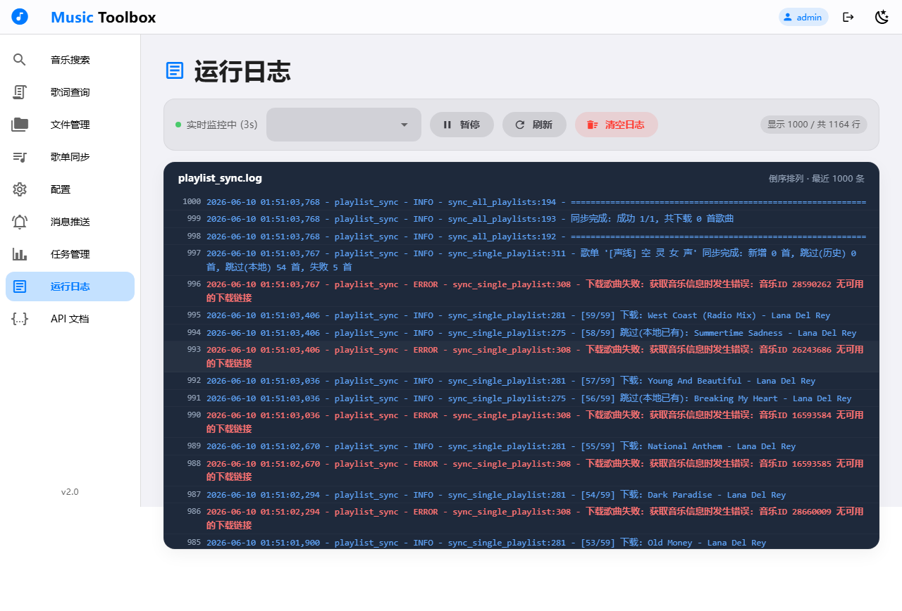
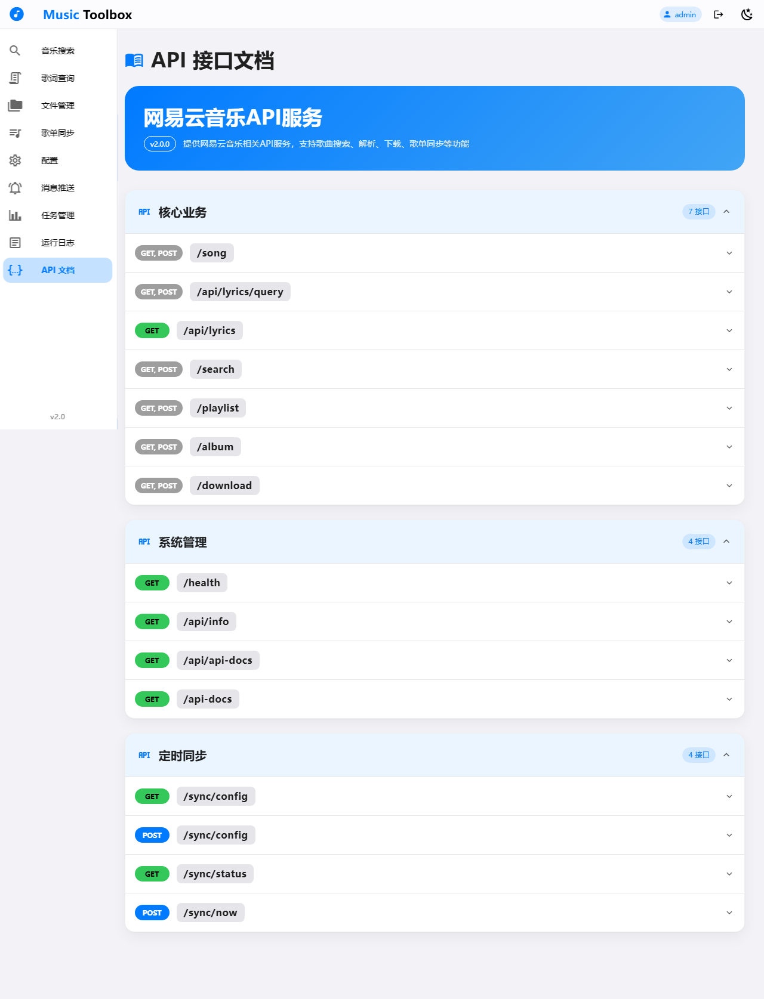
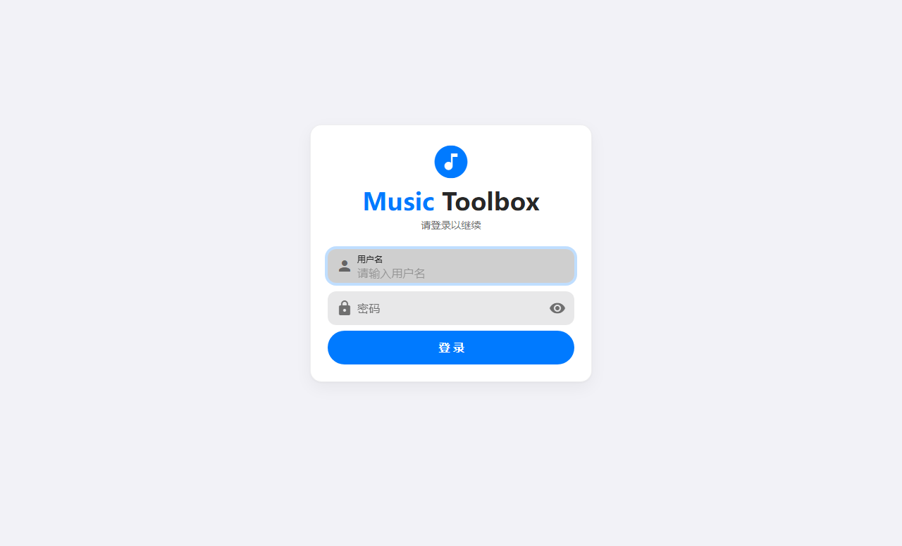

# 音乐工具箱

基于 Flask + Vue 3 的网易云音乐 API 服务，支持歌曲搜索、解析、下载、歌单同步、歌词查询、消息推送、AI 音乐特征评分、K歌模式，提供现代化 Web 管理界面。

## TODO list

### ✅ 2.0 基础功能

- [x] 添加更多 API 端点
- [x] 增加"我的"功能，查看当前 cookie 对应账号信息
- [x] 📡 API 文档 Postman 化改造
- [x] ~~可对当前账号喜欢的音乐镜像操作~~
- [x] 同步功能，开启歌单完全匹配，同步删除本地歌曲

### 🚀 3.0 智能音乐平台

- [x] 添加用户注册与多用户权限管理功能
- [x] 🎵 **Librosa 基础声学维度**：实现 7 维音频特征信号精准评分 (`music_processor.py`)
- [x] **引入 PANNs 神经网络模型**：全自动分析生成百种音频标签（音色/流派/乐器精准度）
- [x] **引入 Ollama + 局部大语言模型 (LLM)**：语义化抽取歌词的高级意境与文本主题（深夜Emo/国风/热血）
- [x] **引入 Demucs 声源分离**：剥离人声、贝斯、鼓组音轨，实现精细化音色口味匹配
- [x] **多模型特征权重聚合引擎 (后端)**：建立 `weight_config.json` 矩阵，将 4 大时段与跨模型指标进行融合加权排序
- [x] **Aero-Material 四轨 Tab 联动面板 (前端)**：将播放、谱图、调音台、历史整合至同一菜单页下，切换采用果味拟态高通透毛玻璃视觉
- [x] **智能发现与隐式行为埋点 (前端/后端)**：集成网易云热榜与手动歌单拉取源；前端无感监测播放时长，未满 20% 切换自动上报 `is_skipped` 日志闭环
- [x] **流媒体播放与 LRC 歌词同步 (前端/后端)**：后端代理网易云直链流式播放，前端 LRC 逐行动态高亮，CD 唱片旋转效果
- [x] **历史追踪与有效聆听轴 (前端)**：实现瀑布流式听歌历史看板，可视化每首歌的实际聆听比例，为后续优化相似度算法提供隐式反馈数据
- [x] **自定义音乐集合系统 (前端/后端)**：支持在推荐流中悬浮 ⊕ 按钮将歌曲加入自定义集合；DNA 谱图页展示所有集合雷达卡片（缩略版 10 维雷达图 + TOP 3 共鸣曲目）；后端 `collections` / `collection_tracks` 表 + CRUD + 聚合雷达 API
- [ ] **歌单图谱一键解析 (前端/后端)**：DNA 谱图页新增「歌单解析」卡片，输入歌单链接或 ID 即可触发后台异步分析（TaskManager 下载 → CAS → 打分），完成后以歌单雷达卡片形式展示（含封面、曲目数、10 维雷达图）
- [ ] **猜你喜欢推荐算法**：基于 Librosa/PANNs/Ollama/Demucs 多维特征向量的相似度（Cosine Similarity），结合播放历史日志实现精准私有化推荐
- [ ] **猜你不喜欢避坑系统**：黑名单机制，根据频繁被用户跳过（Skipped）的音乐特征主动克隆排除类似曲风
- [x] **喜欢**：喜欢、取消喜欢和网易云联动
- [ ] **歌曲持久化存储优化**：现在下载的歌曲一个用户存储一份，导致本地空间占用过大，优化歌曲下载，本地只保留一份，不同的用户新建一张表来维护保存不同用户的不同歌曲

### 🎤 4.0 K歌模式

- [ ] 🎙️ K歌点歌台 — 搜索歌曲即时显示原唱/伴奏切换
- [ ] 🔊 Demucs 实时人声分离 — 一键消除原唱转为伴奏
- [ ] 📜 滚动歌词同步 — LRC 歌词逐行高亮滚动（类 KTV 字幕）
- [ ] 🎚️ 音调升降调节 — 实时变调适配不同音域
- [ ] 🎛️ 混响/均衡器 — 简易人声效果增强
- [ ] 📊 演唱评分 — 音准+节奏 AI 打分（基于 pitch detection）
- [ ] 🏆 K歌排行榜 — 用户演唱得分排行
- [ ] 🎵 伴奏下载 — Demucs 分离后伴奏一键保存

### 🎤 4.5 智能家庭客厅 KTV (声卡硬件级混音与双模提词系统)

- [ ] **高精度时间轴广播器 (前端/后端)**：在电脑端网页利用 Web Audio API (对接 Audient iD4 声卡) 播放 Demucs 分离出的纯伴奏音轨，建立 `requestAnimationFrame` 级高频 ticker，实时广播精确到毫秒的播放进度
- [ ] **HDMI 扩展屏全屏提词器 (前端 - 模式A)**：支持一键弹出独立的无边框纯净大屏窗口 `KtvDisplay.html`，可通过 HDMI 拖动至电视全屏显示，利用 `BroadcastChannel` 实现电脑点歌台与电视提词器的零网络延迟逐字染色同步
- [ ] **WebSocket 跨端同步网关 (后端 - 模式B)**：构建轻量级 WebSocket 播控房间服务，专用于将电脑网页端的歌曲元数据、卡拉 OK 歌词矩阵及高频播放快照无感同步给局域网内的远端大屏设备
- [ ] **Aero-Material 网页 K 歌播控台 (前端)**：采用果味拟态风格，集成基于 Web Audio API `GainNode` 的“伴奏/原唱”多轨硬件路由推子、一键切歌、以及针对无线提词网络延迟的“视觉动态提前量补偿滑块”

### 📱 5.0 全终端智能生态 (TV 原生视觉节点版)

- [ ] **Android 客户端骨架搭建**：基于 Kotlin + Jetpack Compose 或是 Flutter 打造 Aero-Material 风格移动端，支持 Material You 动态色彩同步
- [ ] **底层音频流播放器核心**：对接后端分析引擎，无缝接入本地缓存与网易云无损音源播放，实现低延迟音频流式加载
- [ ] **原生移动端隐式反馈埋点**：完美对齐桌面端，实现前台/后台播放时间精准打点，支持手势滑动切歌（Swipe to Skip）触发 `is_skipped` 策略反哺
- [ ] **通知栏与常驻状态栏调音台**：设计 Android MediaSession 深度融合的多功能通知栏，允许用户在通知栏直接快速微调当前时段的特征推送权重（如一键拉满低音）、一键喜欢、取消喜欢
- [ ] **移动端播控中心 (Android/Flutter)**：打造移动端 Aero-Material “掌上点歌台”，可通过局域网无缝遥控电脑主机的播放状态、切歌、微调多模型权重矩阵及时段配置
- [ ] **纯视觉大屏渲染节点 (Android TV APK)**：基于 Jetpack Compose 构建无音频解码的专属 TV 渲染端，作为纯粹的视觉节点，通过长连接 WebSocket 极低开销地接收电脑端发送的播控信令
- [ ] **TV 端原生 60帧全景谱图与 K 歌提词**：电视端 APK 收到网络时钟信令后，在本地利用 Android 原生动画引擎渲染完全没有音画同步包袱的 60 帧逐字 K 歌提词器与动态全景 DNA 谱图
- [ ] **多端隐式反馈实时打点**：无论是电视端物理遥控器对点歌台发出的间接切歌指令，还是手机端、电脑端的直接滑歌，均能完美对齐精准捕获实际播放比例，统一上报至服务端的播放日志闭环


### 🎵 智能推荐技术路线图

```
[当前阶段] Librosa 基础声学维度 ✅ 已完成
   │
   ▼
[进阶阶段] 引入 PANNs 模型 ✅ 已完成 ─> 全自动百种标签生成 (音色/流派/乐器)
   │
   ▼
[高阶阶段] 引入 Ollama + LLM ──> 抽取歌词的高级意境主题 (深夜/国风/热血)
   │
   ▼
[终极阶段] 引入 Demucs 声源分离 ─> 拆解人声与贝斯，实现极其变态的细节口味匹配
```

| 阶段 | 技术栈 | 输出 | 状态 |
|------|--------|------|------|
| **基础声学** | `librosa` + `mutagen` + `snownlp` + `sqlite3` | 7 维评分（速度/能量/明亮/节奏/音调/起伏/情感） | ✅ 已完成 |
| **深度学习标签** | `PANNs` (Cnn14/Wavegram) 预训练模型 | 100+ 自动标签（流派、乐器、音色属性） | ✅ 已完成 |
| **语义理解** | `Ollama` + 本地 LLM（qwen2:1.5b） | 歌词意境标签（失恋/暗黑/孤独/国风古韵等） | ✅ 已完成 |
| **声源分离** | `Demucs` (Hybrid Transformer) | 人声/伴奏独立评分（人声主导度/重低音轰炸度） | ✅ 已完成 |
| **K歌模式** | `Demucs` + `Web Audio API` + `pitch.js` | 实时消原唱、滚动歌词、音准评分、变调混响 | 🔲 规划中 |

> **运行现有脚本：** `cd backend && python music_processor.py`
> 数据库位置：`config/music_vault.db`
> 依赖安装：`pip install -r requirements.txt`

### 后端（Flask）

```bash
pip install -r requirements.txt
cd backend
python main.py
# 后端运行在 http://localhost:5000
```

### 前端（Vue 3 + Vite）

```bash
cd frontend
npm install
npm run dev
# 前端运行在 http://localhost:3000，自动代理 API 到 :5000
```

### 默认账号

| 用户名 | 密码 |
|--------|------|
| `admin` | `admin123` |

账号配置位于 [`config/users.json`](config/users.json)。

### Docker 部署

```bash
docker-compose up -d
```

## 🌐 页面功能

| 路径 | 页面 | 功能 |
|------|------|------|
| `/` | 业务操作 | 歌曲搜索、单曲/歌单/专辑解析、音乐下载 |
| `/files` | 文件管理 | 本地下载文件浏览、音频播放、删除管理 |
| `/lyrics` | 歌词查询 | 按歌曲/歌手/歌词关键词检索本地歌词库 |
| `/sync` | 歌单同步 | 定时/手动同步网易云歌单到本地 |
| `/config` | 配置 | 同步配置、下载配置 & Cookie 管理 |
| `/mixer` | 权重调音台 | 4 时段音乐推荐权重精细调控（暗黑调音台风格） |
| `/magicpush` | 消息推送 | 推送配置管理 + 事件模板管理 |
| `/tasks` | 任务监控 | 实时下载任务进度跟踪 |
| `/api-docs` | API 接口文档 | 全部 API 端点说明与示例 |
| `/logs` | 运行日志 | 实时查看服务日志（3s 刷新） |

### 页面截图

#### 业务操作（首页）


#### 文件管理


#### 歌词查询


#### 歌单同步


#### 配置管理


#### 消息推送


#### 任务监控


#### 运行日志


#### API 接口文档


#### 登录页面


## 🔌 API 端点

### 认证

| 方法 | 路径 | 说明 |
|------|------|------|
| POST | `/api/auth/login` | 用户登录 |
| POST | `/api/auth/register` | 用户注册 |
| GET | `/api/auth/verify` | 验证 Token 有效性 |

### 音乐服务

| 方法 | 路径 | 说明 |
|------|------|------|
| GET | `/health` | 健康检查 |
| GET/POST | `/song` | 获取歌曲信息（URL/歌词/详情） |
| GET/POST | `/search` | 搜索音乐 |
| GET/POST | `/playlist` | 获取歌单详情 |
| GET/POST | `/album` | 获取专辑详情 |
| GET/POST | `/download` | 下载音乐文件（流式代理 + 音质降级） |
| POST | `/api/lyrics/query` | 歌词查询 |

### 同步

| 方法 | 路径 | 说明 |
|------|------|------|
| GET/POST | `/api/sync/config` | 定时同步配置 |
| GET | `/api/sync/status` | 同步状态查询 |
| POST | `/api/sync/now` | 立即触发同步 |

### 配置 & Cookie

| 方法 | 路径 | 说明 |
|------|------|------|
| GET | `/api/cookie` | 获取 Cookie 配置 |
| POST | `/api/cookie` | 保存 Cookie 配置 |
| POST | `/api/cookie/activate` | 激活指定 Cookie |
| DELETE | `/api/cookie/{name}` | 删除 Cookie |
| GET | `/api/qq/cookie` | 获取 QQ 音乐 Cookie |
| POST | `/api/qq/cookie` | 保存 QQ 音乐 Cookie |
| GET | `/api/settings` | 获取设置 |
| POST | `/api/settings` | 保存设置 |

### 文件管理

| 方法 | 路径 | 说明 |
|------|------|------|
| GET | `/api/files/list` | 文件列表 |
| POST | `/api/files/delete` | 删除文件 |
| GET | `/api/files/read/{name}` | 读取文件 |
| POST | `/api/files/save` | 保存文件 |
| GET | `/api/files/stream/{name}` | 文件流播放/下载 |

### 任务监控

| 方法 | 路径 | 说明 |
|------|------|------|
| GET | `/api/tasks` | 任务列表 |
| DELETE | `/api/tasks/{id}` | 删除任务 |
| POST | `/api/tasks/clear` | 清理已完成任务 |

### 日志

| 方法 | 路径 | 说明 |
|------|------|------|
| GET | `/api/logs` | 日志内容 API |
| POST | `/api/logs/cleanup` | 清空日志 |

### 消息推送

| 方法 | 路径 | 说明 |
|------|------|------|
| GET | `/api/push/config` | 获取推送配置 |
| POST | `/api/push/config` | 保存推送配置 |
| POST | `/api/push/send` | 发送推送测试 |
| GET | `/api/events/catalog` | 事件目录 |
| GET | `/api/events/history` | 事件历史 |

### 系统

| 方法 | 路径 | 说明 |
|------|------|------|
| GET | `/api/info` | API 服务信息 |
| GET | `/api/api-docs` | API 文档 JSON |

> 完整文档见 Web 界面 `/api-docs`

## 🎵 音质等级

| 参数值 | 说明 | 要求 |
|--------|------|------|
| `standard` | 标准音质 | 黑胶 VIP |
| `exhigh` | 极高音质 | 黑胶 VIP |
| `lossless` | 无损音质 | 黑胶 VIP |
| `hires` | Hi-Res 音质 | 黑胶 VIP |
| `jyeffect` | 高清环绕声 | 黑胶 VIP |
| `sky` | 沉浸环绕声 | 黑胶 SVIP |
| `jymaster` | 超清母带 | 黑胶 SVIP |

> 下载时如请求音质不可用，自动逐级降级：`jymaster → sky → jyeffect → hires → lossless → exhigh → standard`

## 📁 项目结构

```
├── backend/                      # Flask 后端
│   ├── main.py                   # 入口，路由注册
│   ├── auth.py                   # 用户认证 & Token 管理
│   ├── music_api.py              # 网易云 API 封装（加密、请求）
│   ├── music_downloader.py       # 音乐下载器（含 mutagen 标签写入）
│   ├── playlist_sync.py          # 定时歌单同步（APScheduler）
│   ├── cookie_manager.py         # Cookie 读写管理
│   ├── qr_login.py               # 扫码登录
│   ├── task_manager.py           # 通用任务管理器
│   ├── event_bus.py              # 事件总线（发布/订阅）
│   ├── push_manager.py           # 消息推送管理
│   ├── lyrics_db.py              # 本地歌词数据库
│   └── qq_music_api.py           # QQ 音乐 API 封装
├── frontend/                     # Vue 3 前端
│   ├── index.html                # HTML 入口
│   ├── vite.config.js            # Vite 配置（含 API 代理）
│   └── src/
│       ├── main.js               # Vue 应用入口（Vuetify 配置）
│       ├── App.vue               # 根组件（导航 + 路由）
│       ├── router.js             # 路由配置（含登录守卫）
│       ├── api/
│       │   ├── index.js          # API 接口封装
│       │   └── authAxios.js      # 认证拦截器
│       ├── styles/
│       │   └── apple-theme.css   # Apple 风格主题
│       └── views/
│           ├── Login.vue              # 登录页
│           ├── BusinessOperation.vue  # 业务操作（首页）
│           ├── FileManagement.vue     # 文件管理
│           ├── LyricsQuery.vue        # 歌词查询
│           ├── PlaylistSync.vue       # 歌单同步
│           ├── ConfigPage.vue         # 配置管理
│           ├── MagicPush.vue          # 消息推送
│           ├── TaskMonitor.vue        # 任务监控
│           ├── RunningLogs.vue        # 运行日志
│           ├── WeightSettings.vue     # 权重调音台
│           └── ApiDocs.vue            # API 文档
├── config/                       # 配置文件
│   ├── users.json                # 用户列表
│   ├── settings.json             # 运行配置
│   ├── api.json                  # API 文档定义
│   ├── lyrics.db                 # 歌词数据库
│   ├── weight_config.json        # 时段权重配置（4时段 × 10特征维度）
│   ├── qq_music_api.json         # QQ 音乐 API 配置
│   └── users/{username}/         # 用户专属配置
│       ├── cookies.json          # Cookie 配置
│       ├── settings.json         # 个人设置
│       ├── sync_config.json      # 同步配置
│       ├── push_config.json      # 推送配置
│       └── qq_cookie.json        # QQ 音乐 Cookie
├── screenshots/                  # 页面截图
├── requirements.txt              # Python 依赖
├── Dockerfile
├── docker-compose.yml
└── entrypoint.sh
```

## 🛠 技术栈

| 层级 | 技术 |
|------|------|
| 后端框架 | Python Flask |
| 前端框架 | Vue 3 + Vite |
| UI 组件库 | Vuetify 3 (Material Design) |
| 路由 | Vue Router 4 |
| HTTP 客户端 | Axios |
| 认证 | itsdangerous (JWT-like Token) |
| 定时任务 | APScheduler |
| 音频标签 | mutagen |
| 容器化 | Docker + docker-compose |

## ⚠️ 注意事项

- 需要网易云音乐黑胶会员账号 Cookie 才能解析高音质
- Cookie 通过 Web 界面 `/config` → Cookie 配置管理，支持多 Cookie 切换
- 同步配置和 Cookie 在 `/config` 页面中分别管理
- 支持多用户体系，每个用户有独立的配置目录 `config/users/{username}/`

## 📄 许可证

MIT License
