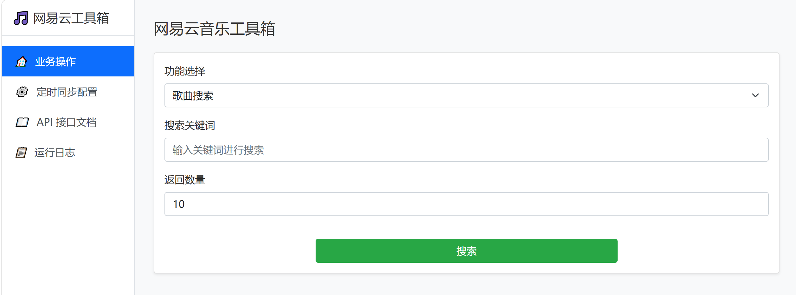
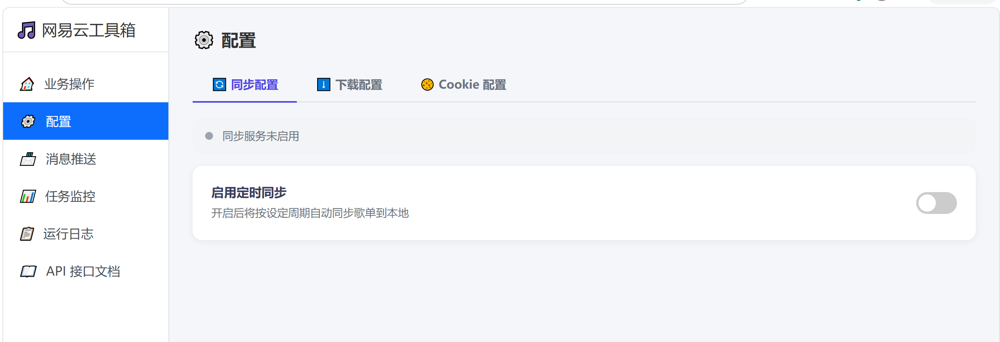
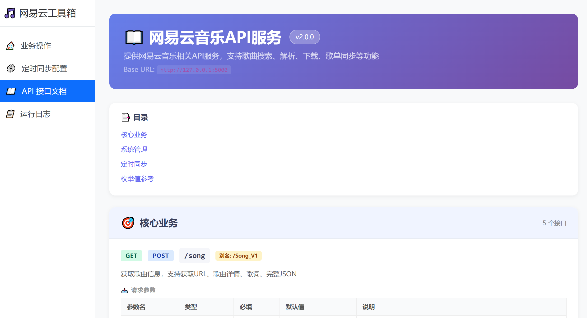
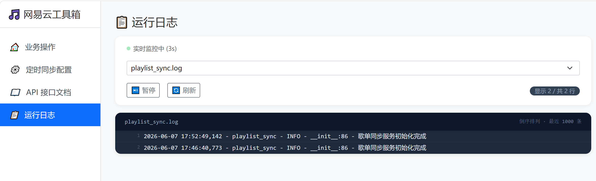

# 网易云音乐工具箱

基于 Flask 的网易云音乐 API 服务，支持歌曲搜索、解析、下载、歌单同步，提供 Web 管理界面。

## 🚀 快速开始

```bash
pip install -r requirements.txt
# 将黑胶会员 Cookie 写入 cookie.txt
python main.py
# 访问 http://localhost:5000
```

Docker 部署：

```bash
docker-compose up -d
```

## 🌐 页面功能

| 路径 | 页面 | 功能 |
|------|------|------|
| `/` | 业务操作 | 歌曲搜索、单曲/歌单/专辑解析、音乐下载 |
| `/config` | 定时同步配置 | 配置歌单定时自动同步 |
| `/api-docs` | API 接口文档 | 全部 API 端点说明与示例 |
| `/logs` | 运行日志 | 实时查看服务日志（3s 刷新） |

### 页面截图

#### 🏠 业务操作 — 搜索 / 歌单解析 / 专辑解析 / 下载



#### ⚙️ 定时同步配置 — 歌单管理 / 音质选择 / Cron 调度



#### 📖 API 接口文档 — 折叠式端点说明



#### 📋 运行日志 — 实时查看 / 文件切换



## 🔌 API 端点

| 方法 | 路径 | 说明 |
|------|------|------|
| GET | `/health` | 健康检查 |
| GET/POST | `/song` | 获取歌曲信息（URL/歌词/详情） |
| GET/POST | `/search` | 搜索音乐 |
| GET/POST | `/playlist` | 获取歌单详情 |
| GET/POST | `/album` | 获取专辑详情 |
| GET/POST | `/download` | 下载音乐文件 |
| GET/POST | `/sync/config` | 定时同步配置 |
| GET | `/sync/status` | 同步状态查询 |
| POST | `/sync/now` | 立即触发同步 |
| GET | `/api/info` | API 服务信息 |
| GET | `/api/api-docs` | API 文档 JSON |
| GET | `/api/logs` | 日志内容 API |

> 完整文档见 Web 界面 `/api-docs`

## 🎵 音质等级

| 参数值 | 说明 | 要求 |
|--------|------|------|
| `standard` | 标准音质 | 黑胶 VIP |
| `exhigh` | 极高音质 | 黑胶 VIP |
| `lossless` | 无损音质 | 黑胶 VIP |
| `hires` | Hi-Res 音质 | 黑胶 VIP |
| `jyeffect` | 高清环绕声 | 黑胶 VIP |
| `sky` | 沉浸环绕声 | 黑胶 SVIP |
| `jymaster` | 超清母带 | 黑胶 SVIP |

## 📁 项目结构

```
├── main.py                 # 入口
├── code/                   # Python 模块
│   ├── music_api.py        # 网易云 API 封装
│   ├── music_downloader.py # 下载器
│   ├── playlist_sync.py    # 定时同步
│   ├── cookie_manager.py   # Cookie 管理
│   └── qr_login.py         # 扫码登录
├── config/
│   ├── settings.json       # 运行配置
│   └── api.json            # API 文档定义
├── templates/              # Web 页面
├── logs/                   # 日志文件
├── downloads/              # 下载目录
└── cookie.txt              # 黑胶 Cookie
```

## ⚠️ 注意事项

- 需要网易云音乐黑胶会员账号 Cookie 才能解析高音质
- 将 Cookie 完整内容写入 `cookie.txt` 文件
- 定时同步配置在 Web 界面 `/config` 中管理

## 📄 许可证

MIT License
